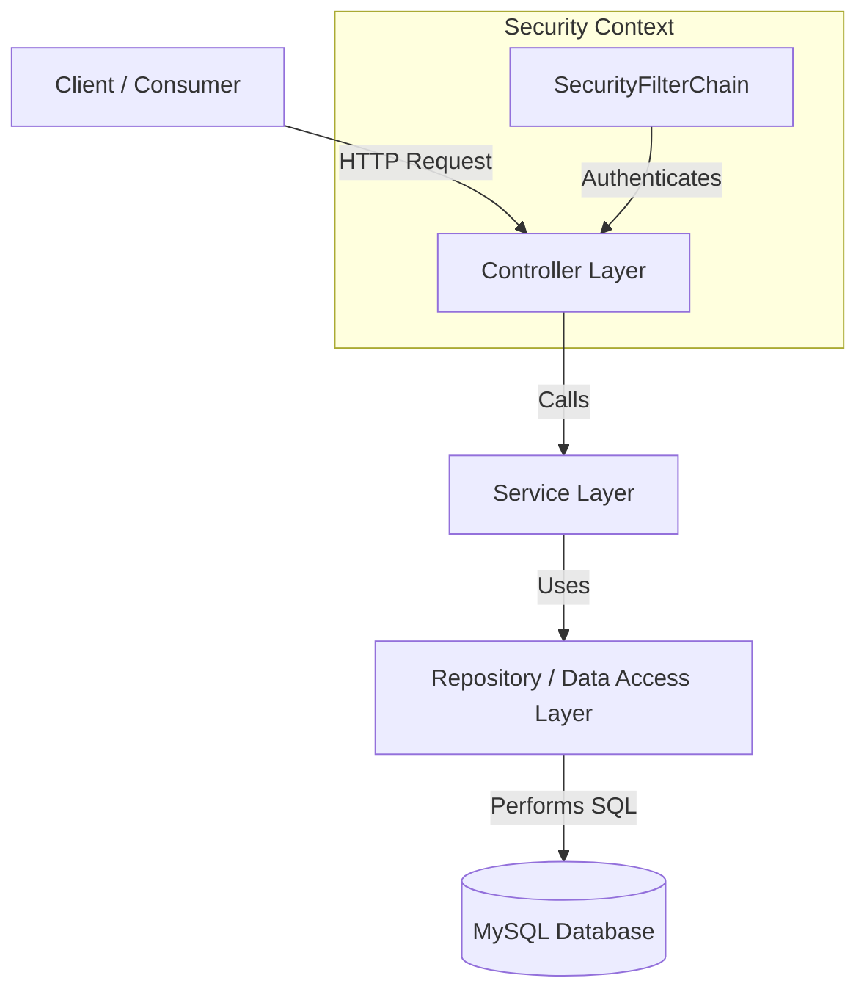

# Sprint Planning Backend Service

Welcome to the **Sprint Planning Backend Service**. This project is a Spring Boot application designed to manage users, greetings, and deployments. It is built using Java 21, Spring Boot 4.0.0, and MySQL.

---

## 🏗️ Architecture Overview

The application follows a standard **layered architecture** pattern, ensuring separation of concerns:



### Flow of Execution
1. **Security Filtering:** All incoming HTTP requests pass through the `SecurityFilterChain` where they are authenticated using HTTP Basic Authentication.
2. **Controller Layer:** Receives the request, extracts URL parameters or JSON request body, delegates execution to the appropriate service, and returns a JSON/text response along with HTTP status codes.
3. **Service Layer:** Houses the business logic. It handles passwords by encoding them (using BCrypt) and orchestrates data access.
4. **Repository Layer:** Acts as an abstraction over database operations using Spring Data JPA.
5. **Database:** Persists entities in a MySQL schema.

---

## 🛠️ Technology Stack

* **Language:** Java 21
* **Framework:** Spring Boot 4.0.0
* **Data Access:** Spring Data JPA / Hibernate
* **Security:** Spring Security (HTTP Basic Auth, BCrypt password hashing)
* **Database:** MySQL 8.x (running on port 3307)
* **Template Engine:** Thymeleaf (infrastructure present, directories empty)
* **Build System:** Maven

---

## 📂 Project Structure

```text
sprint-planning/
├── src/
│   ├── main/
│   │   ├── java/com/example/sprint_planning/
│   │   │   ├── config/
│   │   │   │   └── SecurityConfig.java
│   │   │   ├── controller/
│   │   │   │   ├── DeploymentController.java
│   │   │   │   ├── GreetingController.java
│   │   │   │   └── UserController.java
│   │   │   ├── model/
│   │   │   │   └── User.java
│   │   │   ├── repository/
│   │   │   │   ├── UserList.java
│   │   │   │   └── UserRepository.java
│   │   │   ├── service/
│   │   │   │   ├── DeploymentService.java
│   │   │   │   ├── GreetingService.java
│   │   │   │   └── UserService.java
│   │   │   └── SprintPlanningApplication.java
│   │   └── resources/
│   │       ├── static/ (empty)
│   │       ├── templates/ (empty)
│   │       └── application.properties
│   └── test/
│       └── java/com/example/sprint_planning/
│           └── SprintPlanningApplicationTests.java
├── pom.xml
└── HELP.md
```

---

## ⚙️ Configuration & Setup

### Database Configuration
The application connects to a MySQL database configured in `src/main/resources/application.properties`:
* **URL:** `jdbc:mysql://localhost:3307/sprint_planning`
* **Username:** `root`
* **Password:** `root`
* **Hibernate DDL Auto:** `update` (automatically validates and updates table schemas on start)
* **Hibernate Dialect:** `MySQLDialect`
* **Show SQL:** `true` (prints SQL logs to console for debugging)

### Security Credentials (Default User)
A default user is configured in `application.properties` to allow access via HTTP Basic Authentication:
* **Username:** `admin`
* **Password:** Configured via a BCrypt hash (`$2a$12$35aeR8sMod9T6Gaqe4mQvehR4hqI7fAJZ9IVAVPMNSK.KGbdbhbXi`)

---

## 🔌 API Endpoint Documentation

All endpoints require **HTTP Basic Authentication** (using the `admin` credentials listed above).

| Method | Endpoint | Request Body | Success Status | Description |
| :--- | :--- | :--- | :--- | :--- |
| **GET** | `/api/users` | None | `200 OK` | Retrieves all users in the system. |
| **GET** | `/api/users/{id}` | None | `200 OK` / `404 Not Found` | Retrieves a specific user by their UUID. |
| **POST** | `/api/users/create` | `User` (JSON) | `201 Created` | Creates a new user, hashes their password, and saves them. |
| **PUT** | `/api/users/update/{id}` | `User` (JSON) | `200 OK` | Updates fields of an existing user (only non-null fields provided). |
| **DELETE** | `/api/users/delete/{id}` | None | `204 No Content` | Deletes a user from the system by their UUID. |
| **GET** | `/api/greet` | None | `200 OK` | Returns a system greeting message. |
| **GET** | `/api/farewell` | None | `200 OK` | Returns a system farewell message. |
| **GET** | `/api/sayHello/{name}/{age}` | None | `200 OK` | Returns a customized greeting containing name and age. |
| **GET** | `/api/deployments` | None | `200 OK` | Simulates a deployment status. |

---

## 🔍 Codebase Component Deep-Dive

### 1. Configuration Layer

#### [SecurityConfig.java](src/main/java/com/example/sprint_planning/config/SecurityConfig.java)
Configures HTTP security settings for the application.
* **`filterChain(HttpSecurity http)`**:
  * Disables CSRF (Cross-Site Request Forgery) protection, typical for stateless APIs.
  * Secures all endpoints under `/api/**` (and elsewhere) by requiring authorization (`anyRequest().authenticated()`).
  * Enables HTTP Basic Authentication (`httpBasic(...)`).
* **`passwordEncoder()`**: Exposes a `BCryptPasswordEncoder` bean to securely hash user passwords.

---

### 2. Controller Layer

#### [UserController.java](src/main/java/com/example/sprint_planning/controller/UserController.java)
Exposes REST endpoints to manage `User` entities.
* **`getAllUsers()`**: Calls `UserService.getAllUsers()` and returns the user list.
* **`getUser(UUID id)`**: Calls `UserService.getUserById(id)`. Returns the user wrapped in `ResponseEntity.ok` if found, or `404 Not Found` if missing.
* **`createUser(User user)`**: Calls `UserService.createUser(user)` and returns a `201 Created` response containing the saved user.
* **`updateUser(UUID id, User userDetails)`**: Calls `UserService.updateUser(id, userDetails)` and returns a `200 OK` response with the updated user data.
* **`deleteUser(UUID id)`**: Calls `UserService.deleteUser(id)` and returns a `204 No Content` status.

#### [GreetingController.java](src/main/java/com/example/sprint_planning/controller/GreetingController.java)
Exposes endpoints for testing system greetings.
* **`greet()`**: Returns a greeting string.
* **`farewell()`**: Returns a farewell string.
* **`sayHello(String name, int age)`**: Returns a custom greeting incorporating path parameters.
* *Note: Currently instantiates `GreetingService` directly inside method bodies rather than utilizing Spring's Dependency Injection.*

#### [DeploymentController.java](src/main/java/com/example/sprint_planning/controller/DeploymentController.java)
Exposes endpoints to simulate deployment actions.
* **`deploy()`**: Triggers the simulated deployment service and returns the status string.

---

### 3. Service Layer

#### [UserService.java](src/main/java/com/example/sprint_planning/service/UserService.java)
Contains core business logic for user management.
* **`getAllUsers()`**: Queries database for all users.
* **`getUserById(UUID id)`**: Queries database for user with matching UUID.
* **`createUser(User user)`**: Encodes the password using `PasswordEncoder` if present, then persists the user.
* **`saveAllUsers(List<User> users)`**: Encodes passwords and persists a list of users in a batch.
* **`updateUser(UUID id, User userDetails)`**: Retrieves an existing user by ID, updates its fields (`name`, `password`, `dob`, `email`) if they are present in the payload, encodes any new password, and saves the updated entity. Throws a `RuntimeException` if user does not exist.
* **`deleteUser(UUID id)`**: Deletes user with matching UUID.

#### [GreetingService.java](src/main/java/com/example/sprint_planning/service/GreetingService.java)
Supplies basic text formatting for greetings.
* **`getGreeting()`**: Returns `"Hello, welcome to the Sprint Planning Application!"`.
* **`getFarewell()`**: Returns `"Goodbye, see you next time!"`.
* **`SayHello(String name, int age)`**: Formats a greeting string with name and age.

#### [DeploymentService.java](src/main/java/com/example/sprint_planning/service/DeploymentService.java)
Supplies basic simulation logic for system deployments.
* **`deploy()`**: Returns `"Deployment successful!"`.

---

### 4. Repository & Model Layer

#### [User.java](src/main/java/com/example/sprint_planning/model/User.java)
The JPA database entity representing a `users` table record.
* **Fields**:
  * `id`: UUID primary key, generated automatically using JPA UUID generator.
  * `name`: String representing the user's name.
  * `password`: String representing the hashed password.
  * `dob`: LocalDate representing the user's date of birth.
  * `email`: String representing the email address.

#### [UserRepository.java](src/main/java/com/example/sprint_planning/repository/UserRepository.java)
Provides CRUD database operations for `User` entities. Extends `JpaRepository<User, UUID>`.

#### [UserList.java](src/main/java/com/example/sprint_planning/repository/UserList.java)
A wrapper class holding a `List<User>`.
* *Note: This class is defined but is not referenced or utilized anywhere in the codebase.*

---

## 🛠️ Code Quality Observations & Recommendations

Below are some technical observations made during codebase analysis that should be refactored to align with best practices:

### 1. Tight Coupling / Lack of Dependency Injection in `GreetingController`
* **Issue:** `GreetingController` creates new instances of `GreetingService` directly inside its handler methods (e.g. `new GreetingService().getGreeting()`). This bypasses Spring’s IoC container, making the controller tightly coupled to the implementation and harder to unit test.
* **Recommendation:** Refactor `GreetingController` to use constructor injection to inject the `GreetingService` bean:
  ```java
  private final GreetingService greetingService;
  
  public GreetingController(GreetingService greetingService) {
      this.greetingService = greetingService;
  }
  ```

### 2. Redundant `@Autowired` on Final Field in `UserService`
* **Issue:** In `UserService`, the field `passwordEncoder` is marked with `@Autowired` but is also initialized in the constructor. In newer versions of Spring Boot, constructor parameter injection is automatic, and field-level `@Autowired` on a final field can lead to confusion or IDE warnings.
* **Recommendation:** Remove `@Autowired` from `private final PasswordEncoder passwordEncoder;` as constructor injection is already handling it.

### 3. Unused `UserList` Helper Class
* **Issue:** `UserList.java` exists but is completely unused.
* **Recommendation:** If this was planned for bulk payload deserialization or a specific wrapper structure, keep it; otherwise, it can be deleted to clean up the repository.

### 4. Commented-out Annotations in `User.java`
* **Issue:** `User.java` contains several commented-out Jackson annotations (like `@JsonProperty`, `@JsonFormat`, `@JsonInclude`) and database column directives (`@JdbcTypeCode(Types.VARCHAR)`).
* **Recommendation:** Clean up these comments or uncomment them if they are required to customize serialization/deserialization profiles.

---

## 🚀 How to Run

### Prerequisites
* Java 21 JDK installed.
* MySQL running on port 3307 with a database named `sprint_planning` (or adjust properties in `application.properties`).

### Commands
To build the application and run it locally:
```bash
./mvnw spring-boot:run
```

To run tests:
```bash
./mvnw test
```
